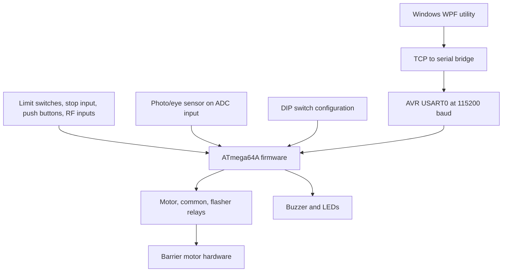
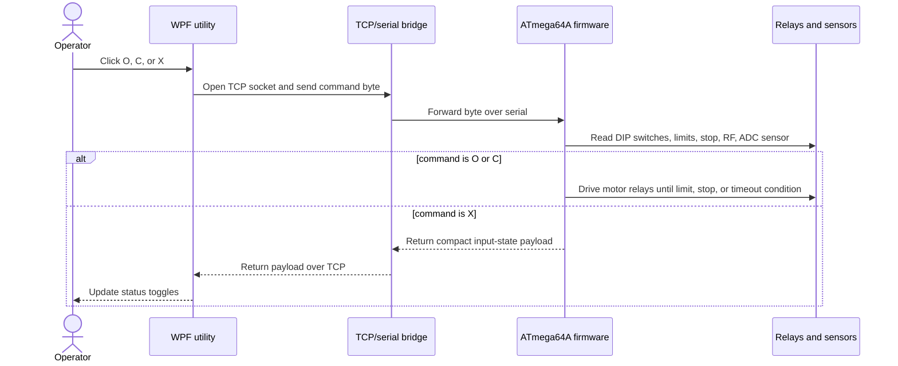

# Barrier Controller

Embedded AVR firmware, Altium hardware design files, and a Windows control utility for a motorized barrier or gate controller.

> Status: archival hardware/firmware repository. The design files and generated build outputs are present, but bench-test procedures, programming instructions, bill of materials, and a license are not yet documented.

## What This Project Does

Barrier Controller contains the design and control software for an ATmega64A-based barrier controller. The repository combines:

- Altium schematic and PCB projects for the main controller board and optocoupler board.
- CodeVisionAVR C firmware for relay-driven open/close control, safety input handling, RF/button input handling, buzzer/LED feedback, and serial command processing.
- A Windows WPF utility that connects over TCP to send commands and poll barrier state through an external network-to-serial bridge.
- Historical firmware, compiled outputs, and board revisions preserved for reference.

The core workflow is a physical controller board receiving local inputs, RF inputs, and remote commands, then driving relays for motor direction and signaling while monitoring limit, stop, and photo/eye sensor inputs.

## Who It Is For

This repository is most useful for:

- Embedded engineers reviewing or reviving the AVR firmware.
- Hardware engineers inspecting the Altium schematic and PCB revisions.
- Maintainers who need to understand the original barrier controller command protocol.
- Developers adapting the Windows utility or replacing it with a modern diagnostic tool.

It is not yet packaged as a plug-and-play production release. Hardware validation and safety review are required before using it on real equipment.

## Repository Map

```text
Barrier-controller/
|-- README.md
|-- Barrier_PrjV2.PrjPcb              # Main Altium PCB project, revision V2
|-- Barrier_SchematicV2.SchDoc        # Main controller schematic, revision V2
|-- Barrier_PCB_V2.PcbDoc             # Main controller PCB, revision V2
|-- Barrier_Schematic.PDF             # Exported schematic PDF
|-- FT232BL.SchDoc                    # FTDI USB/serial schematic document
|-- OptoCoupler/                      # Separate optocoupler Altium project
|-- Source Code/
|   |-- Version7_6_8/Version7_6/      # Latest visible AVR firmware source/build set
|   |-- Version7_*.rar                # Archived firmware snapshots
|   |-- BarrierPRJ2_V3/               # Earlier AVR firmware project
|   |-- BPrj_V0 Proteus With Test/    # Early Proteus-era test project
|   `-- Fusebit.jpg                   # AVR fuse bit reference image
|-- Windoes UI Code/
|   `-- Version 2/SwRel/SwRel/        # Latest visible WPF TCP control utility
`-- __Previews/                       # Altium preview files
```

The folder name `Windoes UI Code` is preserved as it exists in the repository.

## Architecture



The AVR firmware is the control center. It reads physical inputs and optional remote serial commands, applies simple branching logic based on DIP switch state, and drives relay outputs for motor movement and signaling.



Remote control depends on an external bridge that accepts TCP connections and forwards bytes to the AVR serial interface. That bridge is implied by the Windows utility and firmware protocol, but its hardware and configuration are not documented in this repository.

## Core Components

| Component | Responsibility | Source |
|---|---|---|
| Main PCB design | Main controller schematic and PCB layout for the barrier controller board. | `Barrier_PrjV2.PrjPcb`, `Barrier_SchematicV2.SchDoc`, `Barrier_PCB_V2.PcbDoc` |
| Optocoupler board | Separate Altium project for optocoupler isolation circuitry. | `OptoCoupler/Optocoupler.PrjPcb` |
| AVR firmware | Runs on ATmega64A, reads physical inputs, handles serial commands, and drives relay/indicator outputs. | `Source Code/Version7_6_8/Version7_6/VGT7.c` |
| Windows utility | WPF desktop utility for sending open/close/status commands over TCP and displaying selected input states. | `Windoes UI Code/Version 2/SwRel/SwRel/SwRel/` |
| Generated outputs | Compiled AVR artifacts, map/list files, executable UI builds, and historical archives. | `Debug/`, `Release/`, `.rar`, `.hex`, `.cof`, `.exe` files |

## Implemented Capabilities

- **Relay-based barrier actuation.** Firmware controls flasher, motor up, motor common, and motor down relay outputs.
- **Local and RF input handling.** Firmware reads push buttons, RF command inputs, stop input, up/down limit switches, and DIP switches.
- **Photo/eye sensor decision point.** Firmware samples ADC channel 7 and uses a threshold in open/close movement logic.
- **Remote command protocol.** Single-character serial commands support open, close, stop, status, and individual output toggles.
- **TCP-based diagnostic utility.** The WPF app connects to a configured IP/port, sends command bytes, polls status, and displays up/down/eye sensor indicators.
- **Hardware design history.** Multiple Altium revisions and firmware snapshots are kept for recovery and comparison.

## Technology Stack

| Layer | Technology | Purpose |
|---|---|---|
| MCU firmware | C with CodeVisionAVR 3.12 Advanced | ATmega64A control firmware |
| MCU target | ATmega64A, 14.7456 MHz | Main embedded controller |
| Serial protocol | USART0/USART1, 115200 baud, 8N1 | Remote command and status transport |
| PCB design | Altium Designer project files | Schematic and PCB layout |
| Desktop utility | C# WPF, .NET Framework 3.5 | Windows control and polling UI |
| Build metadata | AVR Studio / CodeVisionAVR project files | Firmware project configuration |

## Command Protocol

The latest firmware source handles these command bytes in `TCP()`:

| Command | Behavior |
|---|---|
| `X` | Return a compact status payload containing DIP switch, RF/input, push button, limit, sensor, and stop bits. |
| `C` | Execute close movement logic. |
| `O` | Execute open movement logic. |
| `S` | Stop motor-related relay outputs. |
| `A` | Toggle flasher relay output. |
| `B` | Toggle motor up relay output. |
| `D` | Toggle motor common relay output. |
| `E` | Toggle motor down relay output. |
| `F` | Toggle buzzer output. |
| `G` | Toggle red LED output. |
| `H` | Toggle yellow LED output. |

The Windows utility sends `O`, `C`, and `X` from UI buttons. It also polls by sending `X` on a timer after connecting.

## Quick Start

This repository does not include a single automated build script. Use the relevant toolchain for the part you are working on.

### Inspect the Hardware

1. Install Altium Designer or a compatible Altium file viewer.
2. Open `Barrier_PrjV2.PrjPcb`.
3. Inspect `Barrier_SchematicV2.SchDoc` and `Barrier_PCB_V2.PcbDoc`.
4. Use `Barrier_Schematic.PDF` when only a schematic export is needed.

### Build the Firmware

Prerequisites:

- CodeVisionAVR 3.12 Advanced or a compatible version.
- AVR Studio integration capable of loading the included `.cproj`/`.prj` files.
- ATmega64A programming hardware.

Recommended starting point:

```text
Source Code/Version7_6_8/Version7_6/VGT7.cproj
```

Open the project in the AVR/CodeVisionAVR environment and build the desired configuration. The repository already includes generated `.hex`, `.cof`, `.map`, `.lst`, and object files under `Debug/` and `Release/`, but rebuilding from source is recommended before programming hardware.

### Run the Windows Utility

Prerequisites:

- Windows with .NET Framework 3.5 support.
- Visual Studio capable of opening the WPF project, or the included built executable.
- A reachable TCP-to-serial bridge connected to the controller serial interface.

Project path:

```text
Windoes UI Code/Version 2/SwRel/SwRel/SwRel.sln
```

Runtime behavior:

1. Enter the bridge IP address and port.
2. Use `Command( O )` to send open.
3. Use `Command( C )` to send close.
4. Use `Command( X )` or `Start Listening` to poll status.

The UI defaults shown in source are IP `192.168.1.117`, port `8080`, and polling interval `1000` ms. Treat those as local development defaults, not universal deployment values.

## Configuration

| Setting | Location | Default / Observed Value | Description |
|---|---|---|---|
| MCU | `VGT7.cproj`, `VGT7.prj` | `ATmega64A` | Firmware target microcontroller. |
| CPU clock | `VGT7.prj`, source header | `14.745600 MHz` | AVR clock used by generated timing and serial settings. |
| USART baud | `VGT7.c` | `115200` | Serial transport used by command/status protocol. |
| TCP host | `MainWindow.xaml` | `192.168.1.117` | Default remote bridge IP shown in the WPF UI. |
| TCP port | `MainWindow.xaml` | `8080` | Default remote bridge port shown in the WPF UI. |
| Poll interval | `MainWindow.xaml` | `1000` ms | Default status polling interval. |

No `.env` file or external configuration template is present.

## Firmware I/O Summary

The latest firmware defines the following named I/O signals:

| Signal | Pin Macro | Purpose |
|---|---|---|
| `Re1` | `PORTA.0` | Flasher relay |
| `Re2` | `PORTA.1` | Motor up relay |
| `Re3` | `PORTA.2` | Motor common relay |
| `Re4` | `PORTA.3` | Motor down relay |
| `WRST` | `PORTA.6` | Wi-Fi reset output |
| `LEDS1` | `PORTA.7` | Yellow LED |
| `Mstop` | `PINF.2` | Motor stop input |
| `DS1`-`DS6` | `PINC.0`-`PINC.5` | DIP switch inputs |
| `LEDS2` | `PORTC.6` | Red LED |
| `BUZZ` | `PORTC.7` | Buzzer |
| `RF1`-`RF6` | `PINB.2`-`PINB.7` | RF/input command lines |
| `SW1`, `SW2` | `PIND.0`, `PIND.1` | Switch inputs |
| `SPB1`, `SPB2` | `PIND.6`, `PIND.7` | Push-button inputs |
| `SUP`, `SDW` | `PIND.4`, `PIND.5` | Up/down limit inputs |
| Photo/eye sensor | ADC channel 7 | Obstruction or presence sensing threshold |

Verify these assignments against the schematic before wiring or modifying hardware.

## Execution Flow

1. Firmware initializes ports, USART0/USART1, ADC, and interrupts.
2. Startup feedback flashes LEDs and pulses the buzzer.
3. In the main loop, DIP switch `DS6` determines whether serial/TCP command handling is active.
4. Local RF and push-button inputs are checked on each loop.
5. Open/close routines drive motor relay outputs until a limit, stop, RF alarm, sensor threshold, or timeout condition is reached.
6. Optional status polling returns compact input-state text to the remote utility.
7. Additional DIP switch logic can blink the red LED or buzzer based on switch input state.

## Examples

| Use Case | Input | Output | Relevant Source |
|---|---|---|---|
| Open barrier remotely | WPF sends `O` over TCP | Firmware executes open routine and drives motor-down relay logic | `MainWindow.xaml.cs`, `VGT7.c` |
| Close barrier remotely | WPF sends `C` over TCP | Firmware executes close routine and checks sensor/limit/stop conditions | `MainWindow.xaml.cs`, `VGT7.c` |
| Poll status | WPF sends `X` | Firmware returns a `$...` status payload parsed into UI indicators | `TCP()` in `VGT7.c`, `ParseMessage()` in `MainWindow.xaml.cs` |
| Stop movement | Serial command `S` or stop/RF condition | Motor-related relay outputs are cleared | `TCP()`, `motorright()`, `motorleft()` |
| Review PCB revision | Open Altium project | Schematic and PCB documents load as the V2 hardware project | `Barrier_PrjV2.PrjPcb` |

## Testing and Quality

Verified from repository evidence:

- Firmware project metadata identifies CodeVisionAVR 3.12 Advanced and ATmega64A.
- WPF project metadata targets .NET Framework 3.5.
- Existing generated firmware artifacts are present, including `.hex`, `.cof`, `.map`, and `.lst` files.
- Existing Windows executable artifacts are present under `bin/Debug`.

Not yet documented or automated:

- No CI workflow is present.
- No unit tests are present.
- No hardware-in-the-loop test procedure is present.
- No reproducible command-line firmware build is documented.
- No schematic/PCB design-rule-check report is included in plain text.

## Deployment and Programming

Deployment is hardware-specific and requires validation:

- Program only hardware that matches the Altium schematic/PCB revision being used.
- Confirm ATmega64A fuse bits, clock source, power rails, relay driver circuitry, limit inputs, and sensor wiring before energizing motor hardware.
- Treat included compiled artifacts as historical outputs until they are rebuilt and validated with the intended toolchain.
- Test relay outputs without a connected barrier motor before live operation.

## Security and Safety

This project controls physical motion. Review it as a safety-critical embedded system before use.

- The TCP utility sends unauthenticated single-byte commands to a configured IP/port.
- The repository does not document encryption, authentication, access control, or network segmentation.
- The emergency stop, limit switch, sensor, and relay behavior should be independently validated on bench hardware.
- Do not expose the TCP bridge to an untrusted network.
- Keep manual override and physical disconnect procedures available during testing.

## Limitations

- No license file is currently present. Add a license before treating the repository as reusable open-source software.
- Build instructions depend on legacy Windows and AVR tooling.
- Hardware setup, BOM, fuse configuration, flashing steps, and calibration are not documented.
- The network bridge hardware/software is not included.
- The WPF utility has hardcoded default IP/port values and basic error handling.
- The repository includes generated binaries and historical archives, which are useful for recovery but make source-of-truth boundaries less clear.
- Real hardware behavior has not been validated in this README update.

## Roadmap

Completed:

- Main Altium controller board files are present.
- Optocoupler board project is present.
- AVR firmware source and generated artifacts are present.
- Windows TCP control utility source and executable artifacts are present.

Recommended next steps:

- Add a license.
- Add a BOM and hardware assembly notes.
- Document AVR fuse bits and flashing procedure.
- Add a wiring diagram for sensors, relays, motor outputs, and the TCP/serial bridge.
- Replace hardcoded UI defaults with configuration.
- Add a hardware safety checklist and bench-test procedure.
- Separate source files from generated binaries in a future cleanup branch.
- Add release tags for known working hardware/firmware combinations.

## Contributing

Before opening a change:

1. State which hardware revision and firmware/UI version you are modifying.
2. Keep generated files separate from source changes when possible.
3. Document any bench-test result, toolchain version, and programming settings used.
4. Avoid changing pin assignments or relay behavior without updating the schematic references and this README.

Use GitHub Issues for bug reports, hardware questions, and proposed improvements.

## GitHub About Values

Recommended repository description:

```text
ATmega64A barrier controller with Altium PCB files, relay-control firmware, and a Windows TCP diagnostic utility.
```

Recommended website:

```text
Leave empty
```

Recommended topics:

```text
embedded-systems
avr
atmega64a
barrier-controller
gate-controller
motor-control
relay-control
altium-designer
pcb-design
codevisionavr
wpf
csharp
serial-communication
tcp-control
hardware
```

## Repository Presentation Recommendations

Critical:

- Add a license file.
- Add safety, wiring, fuse-bit, and flashing documentation before recommending real hardware use.
- Add a clear release tag for the latest validated hardware/firmware/UI combination.

Recommended:

- Add a board render or photo as the GitHub social preview.
- Add a BOM and manufacturing/export package for the active PCB revision.
- Add `CONTRIBUTING.md`, `SECURITY.md`, and issue templates once active maintenance resumes.
- Add a changelog that maps hardware revisions to firmware versions.
- Add a `.gitignore` and consider moving generated binaries to releases in a future cleanup.

Optional:

- Publish schematic excerpts or annotated diagrams in `docs/`.
- Add GitHub Pages documentation if the project becomes actively maintained.
- Modernize the desktop utility or replace it with a small cross-platform diagnostic CLI.

## License

No license file is currently present. Add a license before treating the repository as reusable open-source software.

## Maintainer

The repository is hosted at `github.com/Pouya-Mansournia/Barrier-controller`. No additional maintainer contact channel is documented in the repository.
